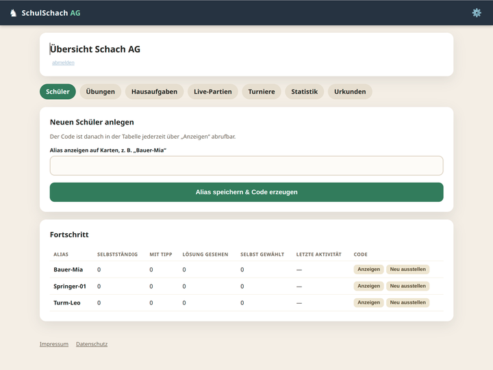
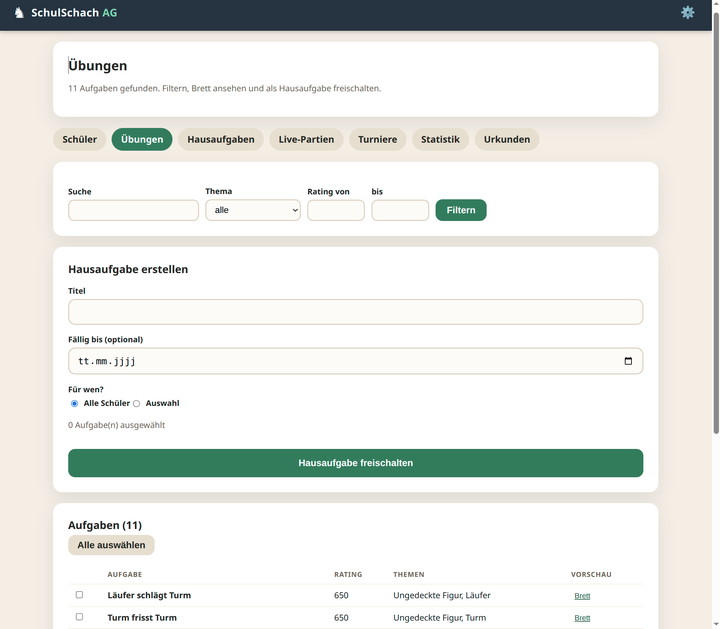
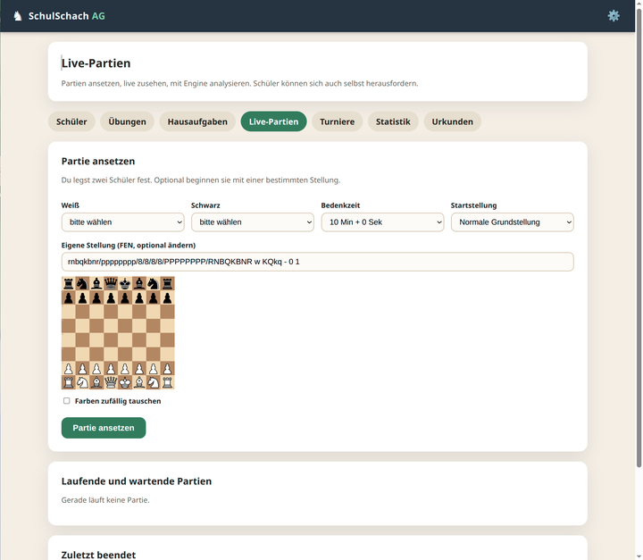
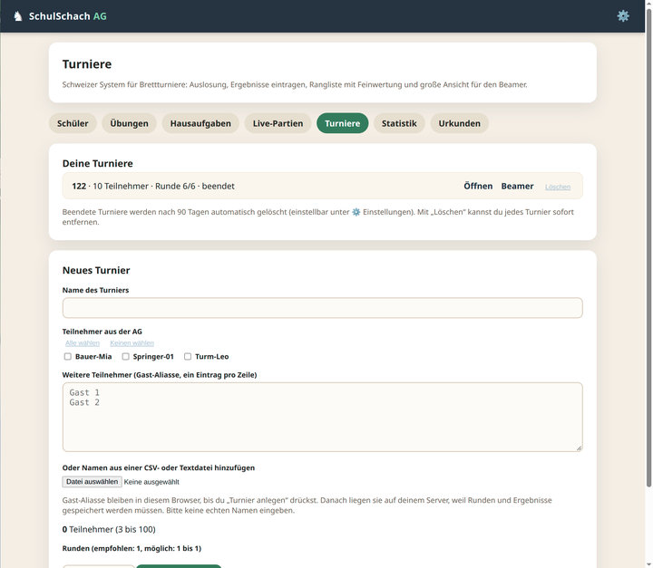

# ♟️ SchulSchach AG

🏫 Datensparsame, selbst gehostete Schach-Lernplattform für eine Schul-AG: Aufgaben lösen 🧩, Hausaufgaben vergeben 📝, live gegeneinander spielen ⏱️, Turniere auslosen 🏆, Fortschritt sehen 📈 und Medaillen sammeln 🏅.

> 🤖 **Hinweis zu KI und Verantwortung (bitte lesen)**
> Dieses Projekt wurde mit Unterstützung von KI-Assistenz (Perplexity) entwickelt. Der Code wurde nicht durch eine unabhängige Sicherheits- oder Datenschutzprüfung geprüft und kann Fehler enthalten.
> ⚠️ **Jede Person und Einrichtung, die dieses Projekt einsetzt, ist selbst für ihre Version verantwortlich**: für Konfiguration, Betrieb, Sicherheitsupdates, Backups, Datenschutz (zum Beispiel DSGVO, Einwilligungen, Verzeichnis der Verarbeitungstätigkeiten) und die Einhaltung der Regeln der eigenen Schule oder Organisation. Das ist keine Rechtsberatung.
> 📜 Die Software wird ohne Gewährleistung bereitgestellt (siehe [LICENSE](LICENSE)).

## 📋 Inhalt

- ✨ Funktionen
- 📸 Einblicke
- 🚀 Schnellstart mit Portainer
- ⚙️ Konfiguration
- 🛠️ Betrieb
- 💻 Lokale Entwicklung
- 🗂️ Projektstruktur
- 🔒 Datenschutz und Sicherheit
- 🔍 Sicherheitsaudit
- 📖 Fachbegriffe kurz erklärt
- 📚 Zitation und Quellen
- 🤝 Eigene Version betreiben

## ✨ Funktionen

**🧒 Für Schülerinnen und Schüler**

- 🔑 Anmeldung nur mit persönlichem Code (kein Passwort, keine E-Mail, kein Klarname)
- 🛤️ Lernpfade mit Modulen, zum Beispiel Startklar, Matt-Muster, Taktik-Werkzeugkasten, Endspiel-Grundlagen, Verteidigung und Geduld
- ♞ Interaktives Schachbrett, auch mit mehrzügigen Aufgaben (der Gegner antwortet automatisch)
- 💡 Dreistufige Hilfe: Hinweis, Zielfeld, Lösung
- 📝 Hausaufgaben des Trainers und freies Üben nach Thema und Schwierigkeit
- ⏱️ Live-Partien gegen andere aus der AG mit Schachuhr, ohne Chat; nach der Partie Analyse mit Markierung von Patzern
- 🏅 Medaillen als digitales Belohnungssystem (Aufgabenzahl, Aufgaben ohne Tipp, Tage in Folge, Themenmeister)

**🧑‍🏫 Für den Trainer / die Trainerin**

- 🔐 Anmeldung unter `/trainer` mit einem starken Trainer-Code
- 👥 Schüler mit Alias anlegen, Codes anzeigen oder neu ausstellen
- 🔎 Übungsdatenbank mit Filtern (Thema, Rating, Suche) und Brettvorschau
- 📅 Hausaufgaben für alle oder ausgewählte Schüler, mit Fälligkeitsdatum
- 👀 Live-Partien ansetzen (auch mit eigener Startstellung), live zusehen mit Engine-Analyse, Partien beenden
- 🏆 Turniere im Schweizer System für echte Brettpartien (bis 100 Teilnehmer): Auslosung nach FIDE-Holländisch (C.04.3), Ergebnisse, Rangliste mit Buchholz-Wertungen, große Beamer-Ansicht 📽️, Abmelden einzelner Spieler für künftige Runden und Löschen von Turnieren
- 📊 Statistik je Schüler und Thema inklusive Schwachstellen
- 📜 Urkunden als SVG: Der echte Name wird nur im Browser eingetragen und nie an den Server gesendet
- ⚙️ Einstellungsseite (Zahnrad, nur für Trainer): Name und Untertitel, Farbschemata, Brettfarben, Begrüßungstext, Funktionsschalter, Medaillen-Schwierigkeit, Urkunden-Vorlage, erlaubte Bedenkzeiten für Live-Partien, Aufbewahrungsfristen sowie Impressum und Datenschutz als Markdown
- 🗂️ Gruppen mit eigenem Lernpfad, CSV-Import für Schüler und Turnier-Teilnehmer, Alias-Generator für Spitznamen

## 📸 Einblicke

Einblicke in die vier Hauptbereiche der App:

<table>
  <tr>
    <td align="center" width="50%">
      
      <br><sub><b>Schüler:</b> Alias anlegen, Fortschritt sehen, Code anzeigen oder neu ausstellen</sub>
    </td>
    <td align="center" width="50%">
      
      <br><sub><b>Übungen:</b> Aufgabendatenbank filtern, Brettvorschau, Hausaufgabe freischalten</sub>
    </td>
  </tr>
  <tr>
    <td align="center" width="50%">
      
      <br><sub><b>Live-Partien:</b> Paarung ansetzen, Bedenkzeit wählen, live zusehen und analysieren</sub>
    </td>
    <td align="center" width="50%">
      
      <br><sub><b>Turniere:</b> Schweizer System, Auslosung, Rangliste und große Beamer-Ansicht</sub>
    </td>
  </tr>
</table>

## 🚀 Schnellstart mit Portainer

Voraussetzungen: ein Server mit Docker und Portainer, ein Traefik-Reverse-Proxy mit externem Docker-Netz `web_net` und ein Domainname.

1. In Portainer einen neuen **Stack** im Modus **Repository** anlegen: Repository-URL dieses Projekts, Branch `main`, Compose-Pfad `compose.portainer.yml`.
2. Die Stack-Variablen setzen (siehe Abschnitt „Konfiguration“).
3. Domain anpassen: In `compose.portainer.yml` steht die Domain in den Traefik-Labels (`Host(...)`). Für deine Version dort deine eigene Domain eintragen.
4. **Deploy the stack** starten. Beim ersten Start legt der Container die Datenbanktabellen an (`prisma db push`) und führt den Seed aus. Das Bauen des Images dauert einige Minuten, weil auch die Analyse-Engine installiert wird. ☕
5. Im Produktivbetrieb legt der Seed **keine** Test-Schüler an und schreibt **keine** Zugangscodes in die Logs. Schüler legst du im Trainer-Bereich an; der Code wird dort einmal angezeigt.
6. Unter `https://<deine-domain>/trainer` mit dem Trainer-Code anmelden. 🎉

### 💻 Lokal testen ohne Portainer/Traefik

Zum Ausprobieren auf dem eigenen Rechner genügt Docker; es ist kein Reverse-Proxy nötig:

```bash
cp .env.example .env   # APP_URL=http://localhost:3000 und die restlichen Werte eintragen
docker compose -f compose.local.yml up -d --build
```

Die App läuft danach unter `http://localhost:3000`. Die lokalen Test-Schülercodes stehen einmalig im Log: `docker logs schulschach_app`. Beim lokalen Betrieb über `http://` wird das Anmelde-Cookie automatisch ohne `Secure`-Flag gesetzt; über `https://` (Produktivbetrieb) bleibt es gesetzt. Die lokale Compose-Datei enthält absichtlich keine Datensicherung und keine Ressourcenlimits.

### 🔐 Trainer-Code erzeugen

Der Klartext des Trainer-Codes wird nirgends gespeichert. Erzeuge lokal einen Hash (mindestens 20 Zeichen):

```bash
git clone <dieses-repository>
cd schulschach
npm install
npm run hash:trainer -- "DEIN_LANGER_TRAINER_CODE"
```

Die ausgegebene Zeile `TRAINER_CODE_HASH=scrypt:...` trägst du als Stack-Variable in Portainer ein.

## ⚙️ Konfiguration

| Variable | Pflicht | Bedeutung |
|---|---|---|
| `APP_URL` | ja | Öffentliche Adresse, zum Beispiel `https://chess.example.org` |
| `AUTH_SECRET` | ja | Zufälliger Wert mit mindestens 32 Zeichen |
| `POSTGRES_PASSWORD` | ja | Passwort der Datenbank |
| `TRAINER_CODE_HASH` | ja | Hash des Trainer-Codes, siehe oben |
| `CODE_ENC_KEY` | nein | Schlüssel zum Verschlüsseln der Schülercodes in der Datenbank. Ohne Angabe wird `AUTH_SECRET` verwendet |

⚠️ **Wichtig:** Ändere `AUTH_SECRET` nach dem Start nicht mehr. Die Schüler-Anmeldung und die Entschlüsselung der Codes hängen daran. Bei einer Änderung sind alle Schülercodes ungültig und müssen über „Neu ausstellen“ im Trainer-Bereich neu erzeugt werden. Bewahre die Werte sicher auf (zum Beispiel im Passwortmanager).

Alles Weitere, was das Aussehen und Verhalten der Seite betrifft, stellst du direkt in der App ein (Zahnrad im Trainer-Bereich). Siehe [docs/einstellungen.md](docs/einstellungen.md).

## 🛠️ Betrieb

### 👥 Schüler anlegen

Trainer-Bereich → Schüler → Alias eingeben. Nimm Aliasse statt Klarnamen (zum Beispiel „Bauer-Mia“). Der Code lässt sich in der Tabelle jederzeit anzeigen oder neu ausstellen. Viele Schüler auf einmal legst du über den CSV-Import an (⚙️ → Einstellungen → CSV-Import), wahlweise mit erzeugten Spitznamen.

### 🧩 Aufgaben importieren und Lernpfade bauen

In Portainer → Container `schulschach_app` → Console (`/bin/sh`):

```sh
sh scripts/import-lichess.sh --themes=paths --per-theme=60 --max=6000
```

Das lädt gefiltert Aufgaben aus der Lichess Open Database (CC0), speichert nur die Auswahl und baut die Lernpfade. Details und Parameter: [docs/lichess-import.md](docs/lichess-import.md).

### 📝 Hausaufgaben, Statistik, Urkunden

- **Hausaufgaben:** Trainer-Bereich → Übungen → Aufgaben auswählen → „Hausaufgabe freischalten“.
- **Statistik:** Trainer-Bereich → Statistik. Zeigt je Thema, wie oft Aufgaben selbstständig, mit Tipp oder mit angesehener Lösung gelöst wurden.
- **Urkunden:** Trainer-Bereich → Urkunden → Alias wählen → echten Namen eintragen → Drucken oder als SVG speichern. Der Name bleibt im Browser. Schüler sehen die Urkunden nicht, nur Medaillen.

### ⏱️ Live-Partien

Schüler öffnen auf der Startseite die Spiel-Lobby und fordern sich heraus. Der Trainer kann unter Live-Partien Paarungen ansetzen (auch mit eigener Startstellung), zusehen und mit der Engine analysieren. Regeln, Uhr, Datenhaltung und Technik: [docs/live-schach.md](docs/live-schach.md).

⚠️ Wichtig: Es darf nur **eine** Instanz der App laufen, weil der Live-Nachrichtenverteiler im Speicher arbeitet.

### 🏆 Turniere

Trainer-Bereich → Turniere: Teilnehmer wählen, Gast-Aliasse eintragen, Runden auslosen, Ergebnisse eintragen, Spieler für künftige Runden abmelden, Rangliste ansehen, die große Beamer-Ansicht öffnen und Turniere (auch Probeturniere) mit „Löschen“ entfernen. Regeln, Rangfolge und Grenzen: [docs/turniere.md](docs/turniere.md).

### ⚙️ Einstellungen und Gruppen

Über das Zahnrad oben rechts (nur für angemeldete Trainer) erreichst du die Einstellungen: Name, Farbschema, Brettfarben, Begrüßungstext, Funktionen ein- und ausschalten, Medaillen-Schwierigkeit, Urkunden-Vorlage, erlaubte Bedenkzeiten, Aufbewahrungsfristen sowie Impressum und Datenschutz. Details: [docs/einstellungen.md](docs/einstellungen.md). Mit Gruppen teilst du die AG ein und legst fest, welche Lernpfade jede Gruppe sieht: [docs/gruppen.md](docs/gruppen.md).

### 🔄 Aktualisieren

In Portainer den Stack mit „Pull and redeploy“ neu bereitstellen. Datenbankdaten bleiben im Volume erhalten. Prüfe vor größeren Updates das Backup.

### 💾 Backup

Der Stack enthält den Dienst `pgbackups` (Container `schulschach_pgbackups`). Er sichert die Datenbank jede Nacht und beim Start des Stacks und bewahrt 7 Tagesstände, 4 Wochenstände und 3 Monatsstände auf. Die Dateien liegen im Docker-Volume `schulschach_backups` (in Portainer unter Volumes, mit dem Namen deines Stacks als Präfix). Anleitung zum Kopieren auf einen zweiten Speicherort und zum Wiederherstellen: [docs/datensicherung.md](docs/datensicherung.md).

Einen einzelnen Dump von Hand erzeugst du so:

```sh
docker exec schulschach_db pg_dump -U schulschach schulschach > schulschach-backup.sql
```

Bewahre Backups verschlüsselt und zugriffsgeschützt auf. Sie enthalten Aliasse, Lernstand, Partien und Turniere. Sichere `AUTH_SECRET` (und `CODE_ENC_KEY`, falls gesetzt) getrennt davon, sonst sind Schülercodes aus einer Sicherung nicht mehr lesbar.

## 💻 Lokale Entwicklung

```bash
npm install
cp .env.example .env     # Werte ausfüllen, DATABASE_URL auf eine lokale PostgreSQL zeigen lassen
npx prisma generate
npx prisma db push
npm run db:seed
npm run dev
```

Hinweis: Das Session-Cokie bekommt das `Secure`-Flag nur, wenn `APP_URL` mit `https://` beginnt. Für `npm run dev` mit `APP_URL=http://localhost:3000` funktioniert die Anmeldung daher auch ohne HTTPS (für den Produktivbetrieb bitte immer HTTPS verwenden). Beim Start (`npm run dev`) und beim Build kopiert ein Skript die Analyse-Engine nach `public/engine`.

## 🗂️ Projektstruktur

```
compose.portainer.yml   Stack (App, Datenbank, Datensicherung, Netze, Traefik-Labels)
Dockerfile              Build der App
docker/entrypoint.sh    Start: Datenbank anlegen, Seed, App starten
prisma/                 Datenbankschema und Seed
scripts/                Trainer-Hash, Lichess-Import, Lernpfade bauen, Engine kopieren
src/app/                Seiten und API (Schüler, Trainer, Übung, Medaillen, Statistik, Live-Partien, Turniere, Einstellungen, Gruppen)
src/lib/                Anmeldung, Verschlüsselung, Medaillen, Statistik, Themen, Lernpfade, Live-Logik, Turnier-Logik, Einstellungen, Gruppen
src/components/         Urkunden-Editor (SVG), Live-Brett und Analyse-Panel
docs/                   Import-Anleitung, Live-Schach, Turniere, Einstellungen, Gruppen, Datensicherung, Sicherheitsaudit, Quellen und Lizenzen, Screenshots
```

## 🔒 Datenschutz und Sicherheit

> 🔍 **Prüfergebnis:** Alle hier genannten Maßnahmen sind im [Sicherheitsaudit](docs/sicherheitsaudit.md) dokumentiert – nach OWASP, BSI-IT-Grundschutz und DSGVO, inklusive Verifikationsnachweis, bewusster Restrisiken und einer Checkliste der offenen Punkte für den Betreiber.

- 🙈 Keine Klarnamen im System: Schüler haben nur Alias und Code. Der Name auf Urkunden wird ausschließlich im Browser eingegeben und nicht gesendet oder gespeichert.
- 🚫 Keine Tracker, keine externen Schriften oder CDNs im Betrieb. Das Schachbrett und die Zugprüfung laufen im Browser, die endgültige Prüfung erfolgt serverseitig. Die Engine-Analyse läuft im Browser und sendet keine Stellungen an externe Dienste.
- 🗝️ Codes und Trainer-Code werden mit scrypt gehasht. Schülercodes liegen zusätzlich verschlüsselt (AES-256-GCM), damit der Trainer sie anzeigen kann; datenschutzärmer wäre es, Codes nur einmal beim Anlegen zu zeigen und danach nur neu auszustellen. Sitzungen laufen über HttpOnly-, Secure- und SameSite-Cookies und enden nach 2 Stunden (das `Secure`-Flag entfällt nur lokal ohne HTTPS). Server-Logs enthalten keine Aliasse, Codes, IP-Adressen oder Header, sondern nur allgemeine technische Ereignisse.
- 🛡️ Geschützte Container-Einstellungen: `no-new-privileges`, `cap_drop: ALL`, CPU- und RAM-Limits, Datenbank nur im internen Docker-Netz, TLS über Traefik. Die Anmeldung des Trainers ist gegen Ausprobieren gesperrt: nach fünf Fehlversuchen gibt es 15 Minuten Pause (Zähler nur im Arbeitsspeicher, ohne IP oder Protokoll; ein Neustart hebt die Sperre auf).
- 🧱 Sicherheits-Header (Content-Security-Policy, X-Frame-Options, Referrer-Policy) werden auf allen Seiten gesetzt. Login-Eingaben werden serverseitig auf Format und Länge geprüft, bevor etwas gehasht oder in der Datenbank gesucht wird.
- 🗄️ Gespeichert werden Alias, Anmeldezeitpunkt, Lösungsversuche (Ergebnis, Tipps, Fehlversuche, Dauer, Zeitpunkt), Live-Partien (Alias, Züge, Ergebnis, Bedenkzeit), Turniere (Alias, Paarungen, Ergebnisse) und optional die Gruppenzugehörigkeit. Beendete Partien und Turniere werden nach einer einstellbaren Frist (Standard: 90 Tage) automatisch gelöscht. Es gibt keinen Chat. Prüfe mit deiner Schule, ob dafür eine Einwilligung oder eine andere Rechtsgrundlage nötig ist, und ob Eltern informiert werden müssen.
- 💾 Die automatischen Datensicherungen enthalten diese Daten bis zum Ablauf der Aufbewahrung (7 Tage, 4 Wochen, 3 Monate), auch wenn Inhalte inzwischen gelöscht wurden. Kürze die Fristen in `compose.portainer.yml`, wenn deine Schule das verlangt.
- 📣 Sicherheitslücken bitte nicht öffentlich melden, sondern über eine private Nachricht an den Repository-Inhaber.

## 🔍 Sicherheitsaudit

Das vollständige Prüfprotokoll liegt unter [docs/sicherheitsaudit.md](docs/sicherheitsaudit.md). Es enthält:

- ✅ Bewertung nach OWASP Top 10 / ASVS, BSI-IT-Grundschutz und DSGVO – je Bereich mit Umsetzung, Prüfergebnis und Restrisiko,
- 🧩 eigenen Abschnitt zu Sicherheitsmaßnahmen für Eingabefelder: serverseitige Whitelist-Validierung, Format- und Längenprüfung, kontextabhängige Prüfung, Abweisen statt Umwandeln, keine Eingaben in Logs, Parameterbindung, automatisches Zurücksetzen sensibler Felder und Sperrlogik,
- 📋 Checkliste der offenen Punkte, die nur der Betreiber erledigen kann (Einwilligung, Verzeichnis der Verarbeitungstätigkeiten, Fristen, Backup-Transport, Updates).

## 📖 Fachbegriffe kurz erklärt

Damit auch Leute ohne Schachwissen verstehen, was im Trainer-Bereich steht:

| Begriff | Bedeutung |
|---|---|
| 🎲 **Schweizer System** | Turnierform, in der niemand ausscheidet. In jeder Runde spielen Teilnehmer mit ähnlicher Punktzahl gegeneinander, und dieselben zwei spielen nicht noch einmal gegeneinander. Die Anzahl der Runden ist vorher festgelegt. |
| 🇩🇪 **FIDE-Holländisches System (C.04.3)** | Das am häufigsten benutzte Regelwerk für Schweizer Turniere. Es legt fest, wer gegen wen spielt und wer mit Weiß oder Schwarz beginnt. Die Fassung gilt seit dem 1. Februar 2026. |
| ➖ **Freilos** | Bei ungerader Teilnehmerzahl bleibt pro Runde eine Person ohne Gegner. Sie bekommt einen Punkt, ohne zu spielen, und soll nach Möglichkeit nicht zweimal ein Freilos erhalten. |
| ⚖️ **Feinwertung** | Entscheidet, wer höher platziert wird, wenn mehrere dieselben Punkte haben. |
| 📐 **Buchholz** | Summe der Punkte aller bisherigen Gegner. „Mit einem Streichergebnis“ heißt: Das schlechteste Gegnerergebnis wird weggelassen. Wer gegen starke Gegner gespielt hat, steht höher. |
| 🔁 **Feinbuchholz** | Summe der Buchholz-Werte der Gegner. Sie hilft, wenn auch das Buchholz gleich ist. |
| 🧮 **Sonneborn-Berger** | Summe der Punkte der besiegten Gegner plus die Hälfte der Punkte der Gegner, gegen die Remis gespielt wurde. Es zählt also, gegen wen man gewonnen hat. |
| 🤝 **Remis** | Unentschieden. Beide bekommen einen halben Punkt. |
| 📍 **FEN** | Eine Textzeile, die eine Schachstellung beschreibt. Damit kann der Trainer Partien aus einer bestimmten Stellung beginnen lassen. |
| 🤖 **Engine** | Ein Schachprogramm, das Stellungen bewertet. Hier läuft Stockfish im Browser und sendet nichts an den Server. Die Zahl zeigt, wer besser steht: plus heißt Weiß, minus heißt Schwarz. |
| 🔢 **Rating (bei Aufgaben)** | Schwierigkeitszahl der Lichess-Aufgaben. Kleine Zahl bedeutet leichter. |

## 📚 Zitation und Quellen

Stand der Angaben: **2. Oktober 2026**. Alle Quellen wurden zum Zweck der Orientierung gesichtet oder als Software beziehungsweise Daten eingebunden. Texte aus Regelwerken und Lehrmaterialien wurden **nicht** kopiert.

### 📦 Eingebundene Daten und Software

| Nr. | Quelle (Zitation) | Verwendung | Lizenz |
|---|---|---|---|
| 1 | Lichess.org (o. J.): *Lichess Open Database – Puzzle Database.* <https://database.lichess.org/#puzzles>, abgerufen am 2. Oktober 2026. | Schachaufgaben (gefilterte Auswahl, lokal gespeichert) | CC0 1.0 |
| 2 | Rugg, N. / Chess.com und Mitwirkende (o. J.): *Stockfish.js.* <https://github.com/nmrugg/stockfish.js>, abgerufen am 2. Oktober 2026. | Analyse-Engine im Browser (WebAssembly) | GPL-3.0 |
| 3 | The Stockfish developers (o. J.): *Stockfish.* <https://github.com/official-stockfish/Stockfish>, abgerufen am 2. Oktober 2026. | Schachengine, auf der Stockfish.js beruht | GPL-3.0 |
| 4 | echecsjs (o. J.): *@echecs/swiss – Swiss tournament pairing following FIDE rules*, Version 5.x. <https://github.com/echecsjs/swiss>, abgerufen am 2. Oktober 2026. | Turnier-Auslosung (FIDE-Holländisch) | MIT |
| 5 | Hlywa, J. und Mitwirkende (o. J.): *chess.js.* <https://github.com/jhlywa/chess.js>, abgerufen am 2. Oktober 2026. | Schachregeln und Zugprüfung | BSD-2-Clause |
| 6 | Clariity und Mitwirkende (o. J.): *react-chessboard.* <https://github.com/Clariity/react-chessboard>, abgerufen am 2. Oktober 2026. | Darstellung des Schachbretts | MIT |
| 7 | Vercel, Inc. (o. J.): *Next.js.* <https://nextjs.org>; Prisma Data, Inc. (o. J.): *Prisma.* <https://www.prisma.io>; The PostgreSQL Global Development Group (o. J.): *PostgreSQL.* <https://www.postgresql.org> | Web-Framework, Datenbankzugriff, Datenbank | MIT, Apache-2.0, PostgreSQL License |
| 7a | prodrigestivill (o. J.): *docker-postgres-backup-local.* <https://github.com/prodrigestivill/docker-postgres-backup-local>, abgerufen am 2. Oktober 2026. | Automatische Datenbanksicherung (eigener Container im Stack) | Lizenz bitte auf der Projektseite prüfen |

### 📏 Regelwerke als fachliche Orientierung

Diese Quellen dienten nur zur Orientierung. Es wurden keine Texte übernommen; Regeln und Rechenverfahren sind keine urheberrechtlich geschützten Inhalte.

| Nr. | Quelle (Zitation) | Wofür |
|---|---|---|
| 8 | Fédération Internationale des Échecs (FIDE) (2026): *FIDE Handbook, C.04.3 FIDE (Dutch) System (effective from 1 February 2026).* <https://handbook.fide.com/chapter/C0403202602>, abgerufen am 2. Oktober 2026. | Regeln der Auslosung nach dem Holländischen System |
| 9 | FIDE (2026): *FIDE reminds organizers and arbiters of updated Swiss Rules effective from February 1, 2026.* <https://www.fide.com/fide-reminds-organizers-and-arbiters-of-updated-swiss-rules-effective-from-february-1-2026/>, veröffentlicht am 24. März 2026, abgerufen am 2. Oktober 2026. | Hinweis auf die seit 1. Februar 2026 gültigen Schweizer Regeln |
| 10 | Deutsche Schachjugend (o. J.): *Jugendspielordnung.* <https://www.deutsche-schachjugend.de/uploads/media/DSJ-Spielordnung.pdf>, abgerufen am 2. Oktober 2026. | Reihenfolge der Feinwertungen bei Punktgleichheit |
| 11 | Bayerische Schachjugend e. V. (2026): *Spielordnung.* <https://bayerische-schachjugend.de/wp-content/uploads/Spielordnung-2026.pdf>, abgerufen am 2. Oktober 2026. | Orientierung für Turniere nach Schweizer System in Bayern |

ℹ️ Die Rangfolge im Programm (Punkte, Buchholz mit einem Streichergebnis, Feinbuchholz, Sonneborn-Berger, Siege, Startrangliste) orientiert sich an dieser Praxis. Bei offiziellen Meisterschaften gilt immer die jeweilige Ausschreibung.

### ⚠️ Einschränkungen zur FIDE-Konformität

- Die Auslosung stammt aus der Bibliothek unter Nr. 4. Sie ist **kein** von der FIDE anerkanntes Programm und wurde hier nicht gegen ein anerkanntes Programm geprüft.
- Die Feinwertungen sind eine vereinfachte Umsetzung und decken nicht jeden Randfall der FIDE-Regeln ab.
- Für offizielle Turniere bitte zusätzlich ein anerkanntes Programm und die Ausschreibung nutzen.

Weitere Hinweise: [docs/quellen-und-lizenzen.md](docs/quellen-und-lizenzen.md) und [docs/turniere.md](docs/turniere.md).

### 📝 So zitierst du dieses Projekt

> TJRSchmidbauer (2026): *SchulSchach AG – datensparsame Schach-Lernplattform für Schul-AGs* [Software]. <https://github.com/TJRSchmidbauer/schulschach>, Lizenz MIT.

## 📜 Lizenz

Code und eigene Texte: **MIT**, siehe [LICENSE](LICENSE). Ausgenommen ist die mitgelieferte Analyse-Engine (Stockfish.js, GPL-3.0). Lizenztext und Quellverweis werden mit der Engine ausgeliefert.

## 🤝 Eigene Version betreiben

Du kannst das Projekt forken und für deine Gruppe anpassen. Beachte dabei:

- 🌐 Trage deine eigene Domain, eigene Geheimnisse und einen eigenen Trainer-Code ein. Nutze nie die Werte aus Beispielen oder Logs weiter.
- 🔐 Du bist für deine Instanz und die darauf gespeicherten Daten selbst verantwortlich.
- 📜 Prüfe Lizenzen, bevor du eigene Inhalte (Texte, Aufgaben, Bilder) ergänzt, und nenne die Quellen. Bei der mitgelieferten Engine (GPL-3.0) gelten besondere Bedingungen; siehe die Lizenzdoku.
- 🔍 Änderungen am Code prüfst du bitte selbst, besonders bei Anmeldung, Datenbank und Rechten.
